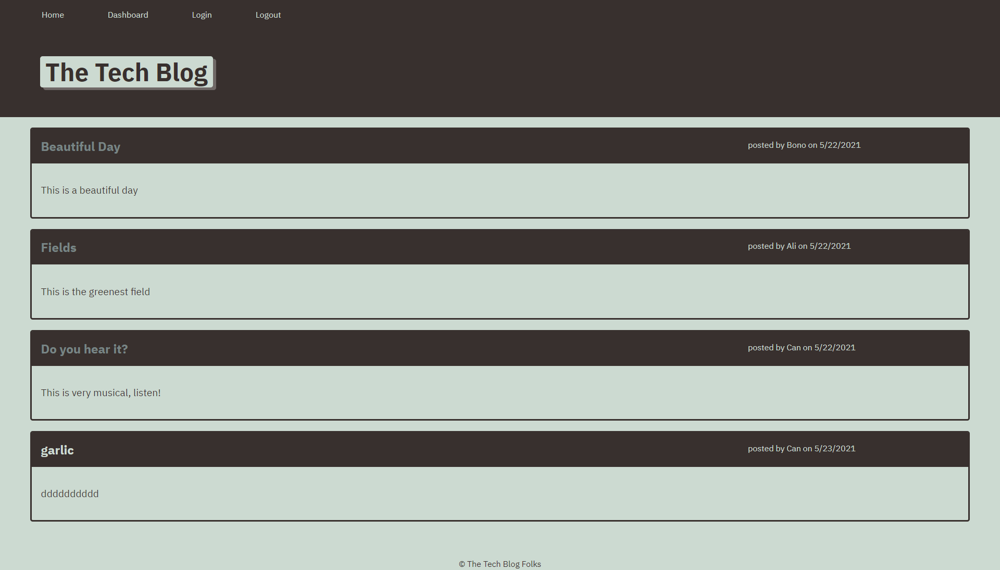

 

## **tech blog** 
 

[https://tech-blog-aranata.herokuapp.com/](https://tech-blog-aranata.herokuapp.com/) 
 

``IMPORTANT NOTE: Please use "password" as password to login as any of the users shown on the app's homepage.``
 
 
## description

***
Writing about tech can be just as important as making it. Developers spend plenty of time creating new applications and debugging existing codebases, but most developers also spend at least some of their time reading and writing about technical concepts, recent advancements, and new technologies. A simple Google search for any concept covered in this course returns thousands of think pieces and tutorials from developers of all skill levels! 
This is a CMS-style blog site similar to a Wordpress site, where developers can publish their blog posts and comment on other developers’ posts as well. App is following the MVC paradigm in its architectural structure, and uses Handlebars.js as the templating language, Sequelize as the ORM, and the express-session npm package for authentication. It was developed over some starter code and deployed to Heroku.  
 
 

## acceptance criteria

***

The codebase achieves the following criteria: 

* GIVEN a CMS-style blog site: 

* WHEN I visit the site for the first time; THEN I am presented with the homepage, which includes existing blog posts if any have been posted; navigation links for the homepage and the dashboard; and the option to log in 

* WHEN I click on the homepage option; THEN I am taken to the homepage 

* WHEN I click on any other links in the navigation; THEN I am prompted to either sign up or sign in 

* WHEN I choose to sign up; THEN I am prompted to create a username and password 

* WHEN I click on the sign-up button; THEN my user credentials are saved and I am logged into the site 

* WHEN I revisit the site at a later time and choose to sign in; THEN I am prompted to enter my username and password 

* WHEN I am signed in to the site; THEN I see navigation links for the homepage, the dashboard, and the option to log out 

* WHEN I click on the homepage option in the navigation; THEN I am taken to the homepage and presented with existing blog posts that include the post title and the date created 

* WHEN I click on an existing blog post; THEN I am presented with the post title, contents, post creator’s username, and date created for that post and have the option to leave a comment 

* WHEN I enter a comment and click on the submit button while signed in; THEN the comment is saved and the post is updated to display the comment, the comment creator’s username, and the date created 

* WHEN I click on the dashboard option in the navigation; THEN I am taken to the dashboard and presented with any blog posts I have already created and the option to add a new blog post 

* WHEN I click on the button to add a new blog post; THEN I am prompted to enter both a title and contents for my blog post 

* WHEN I click on the button to create a new blog post; THEN the title and contents of my post are saved and I am taken back to an updated dashboard with my new blog post 

* WHEN I click on one of my existing posts in the dashboard; THEN I am able to delete or update my post and taken back to an updated dashboard 

* WHEN I click on the logout option in the navigation; THEN I am signed out of the site 

* WHEN I am idle on the site for more than a set time; THEN I am able to view comments but I am prompted to log in again before I can add, update, or delete comments 

 
 

## usage

***

A screenshot that shows the full generated web page: 
 

 
 

## some valuable references

***

These notes and links are listing some valuable references among others that I used doing this project: 
 

[https://developer.mozilla.org/en-US/docs/Glossary/MVC](https://developer.mozilla.org/en-US/docs/Glossary/MVC)

[https://zetcode.com/javascript/sequelize/](https://zetcode.com/javascript/sequelize/)

[https://handlebarsjs.com/](https://handlebarsjs.com/)

[https://coding-boot-camp.github.io/full-stack/heroku/deploy-with-heroku-and-mysql](https://coding-boot-camp.github.io/full-stack/heroku/deploy-with-heroku-and-mysql)

[https://expressjs.com/en/guide/writing-middleware.html](https://expressjs.com/en/guide/writing-middleware.html)

[https://krishankantsinghal.medium.com/local-storage-vs-session-storage-vs-cookie-22655ff75a8](https://krishankantsinghal.medium.com/local-storage-vs-session-storage-vs-cookie-22655ff75a8)

[https://shields.io/category/dependencies/](https://shields.io/category/dependencies/)

[https://www.screencastify.com/](https://www.screencastify.com/)

 
 

## credits

***

Stephen Woosley - Bootcamp Instructor 
Patrick Haberern - Bootcamp TA 
Tim Nagorski - Bootcamp TA 
Sean Walmer - Bootcamp TA 
Alexis San Javier - Bootcamp Tutor 
 
 

## license

***

This is an assigment done under a bootcamp program, it is public but please contact the publisher before you use or
change any content. 
ghibli.github@gmail.com
 
 

## badges

***

 
 
